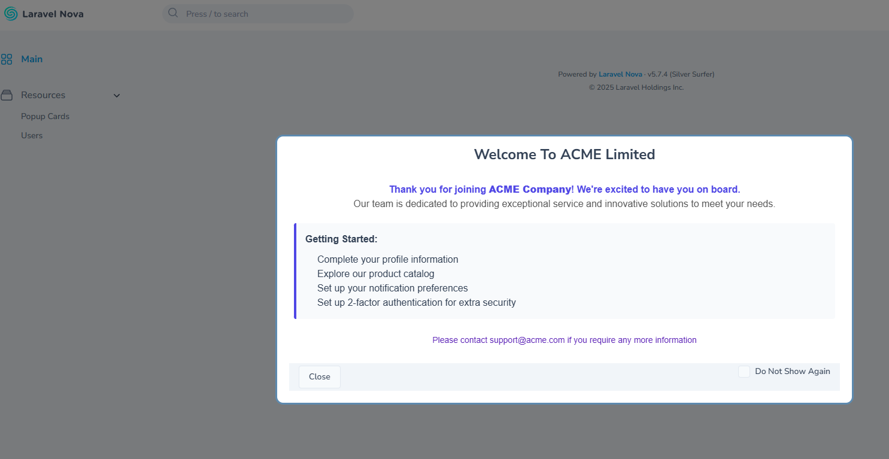

# Laravel Nova Popup Card

[](https://packagist.org/packages/elshaden/popup-card)
[](https://packagist.org/packages/elshaden/popup-card)
[](https://packagist.org/packages/elshaden/popup-card)

A customizable popup modal card for Laravel Nova that automatically displays to users when they access your dashboard or resource pages. Perfect for welcome messages, announcements, notifications, and more.

## 🌟 Features

- **Automatic Display**: Shows popup cards to users when they access specified pages
- **User Tracking**: Remembers which users have seen which popups
- **Do Not Show Again**: Users can opt out of seeing specific popups again
- **Customizable Content**: Full HTML support for rich content in popups
- **Configurable Width**: Choose from multiple width options (1/4, 1/3, 1/2, 2/3, 3/4, full)
- **Targeted Display**: Show different popups on different pages or to specific users
- **Admin Interface**: Manage all your popup cards through a Nova resource
- **Database Storage**: All popup cards and user interactions are stored in the database
- **Configurable Tables**: Customize database table names to fit your application

## Example

Here's an example of how a welcome popup from ACME Company might look:

<div align="center">

  

</div>

*Note: Create this image based on the specifications in docs/images/sample-popup-instructions.md*

## Compatibility

- Laravel Nova 4.x and 5.x
- PHP > = 8.0 up To 8.4
- Laravel >=9.x up to 12.x


## Installation

You can install the package in Laravel Nova app that uses Nova via composer:

```bash
composer require elshaden/popup-card
```

## Package Registration

The package will be automatically registered using Laravel's package auto-discovery. However, if you have disabled auto-discovery, you need to manually register the package's service provider in your `config/app.php` file:

```php
'providers' => [
    // ...
    Elshaden\PopupCard\CardServiceProvider::class,
],
```

## Configuration
You can publish the config file with:
```bash
   php artisan vendor:publish --provider="Elshaden\PopupCard\CardServiceProvider" --tag="popup-card-config"
```

### Database Table Configuration
The package allows you to customize the database table names and foreign keys used by the popup card system. This is useful if you need to avoid table name conflicts or follow specific naming conventions in your application.

Available configuration options:

```php
// config/popup_card.php

// The name of the main table for popup cards
'table_name' => 'popup_cards',

// The name of the pivot table between users and popup cards
'pivot_table' => 'cards_users',

// The foreign key for the user in the pivot table
'user_foreign_key' => 'user_id',

// The foreign key for the popup card in the pivot table
'popup_card_foreign_key' => 'popup_card_id',
```

#### Example: Customizing Table Names

If you want to use custom table names, you can modify these values in your published configuration file:

```php
// config/popup_card.php

// Use a custom table name for popup cards
'table_name' => 'my_custom_popup_cards',

// Use a custom pivot table name
'pivot_table' => 'my_custom_popup_card_user',
```

After changing these values, make sure to run the migrations to create the tables with your custom names.

## Migrations
You can publish the migration with:
```bash
php artisan vendor:publish --provider="Elshaden\PopupCard\CardServiceProvider" --tag="popup-card-migrations"
```

After publishing the migration, you can create the necessary database tables by running the migrations:

```bash 
php artisan migrate
```

This will create two tables:
- `popup_cards`: Stores all your popup cards with their content and settings
- `cards_users`: Pivot table that tracks which users have seen which popup cards


## Usage

### Basic Setup

1. **Add the Trait to Your User Model**

You **MUST** add the `HasPopupCards` trait to your user model. This enables tracking which users have seen which popups:

```php
use Elshaden\PopupCard\Traits\HasPopupCards;

class User extends Authenticatable
{
    use HasPopupCards;
    
    // rest of your model...
}
```

2. **Register the Resource in Nova's Menu**

Add the PopupCard resource to your Nova menu to manage popup cards:

```php
use Elshaden\PopupCard\Nova\PopupCardResource;

Nova::mainMenu(function (Request $request) {
    return [
        // Other menu items...
        MenuItem::resource(PopupCardResource::class),
        // More menu items...
    ];
});
```

### Adding Popup Cards to Pages

You can add popup cards to your dashboard or any resource page. The popup will automatically display when users visit that page.

> **Important**: The name you use in the `->name()` method must match the name of an existing popup card in your database. You need to create the popup card first using the Nova admin panel before you can display it in your code.

#### Dashboard Example

```php
use Elshaden\PopupCard\PopupCard;

public function cards(Request $request)
{
    return [
        // Other cards...
        (new PopupCard())->name('welcome-message')->width('1/2'),
    ];
}
```
In this example, a popup card with the name "welcome-message" must already exist in your database.

#### Resource Example

```php
use Elshaden\PopupCard\PopupCard;

public function cards(Request $request)
{
    return [
        // Other cards...
        (new PopupCard())->name('user-instructions')->width('1/3'),
    ];
}
```
Similarly, a popup card with the name "user-instructions" must already exist in your database.

### Customizing Display Conditions

You can control who sees the popup using Nova's `canSee()` method:

```php
use Elshaden\PopupCard\PopupCard;

public function cards(Request $request)
{
    return [
        // Other cards...
        (new PopupCard())
            ->name('2fa-reminder')
            ->width('1/3')
            ->canSee(function () use ($request) {
                // Only show to users without 2FA enabled
                return !$request->user()->hasTwoFactorEnabled();
            }),
    ];
}
```

In this example, a popup card with the name "2fa-reminder" must already exist in your database. This popup would only be shown to users who don't have two-factor authentication enabled.

### Width Options

You can customize the width of your popup card using one of these options:
- `'1/4'` - 25% of screen width
- `'1/3'` - 33% of screen width
- `'1/2'` - 50% of screen width
- `'2/3'` - 66% of screen width
- `'3/4'` - 75% of screen width
- `'full'` - 100% of screen width


### How It Works: Complete Workflow

Here's a step-by-step explanation of how the popup card system works:

1. **Create a Popup Card in Nova Admin Panel**
   - Navigate to the PopupCard resource in your Nova admin panel
   - Click "Create Popup Card"
   - Fill in the required fields:
     - **Name**: A unique identifier (e.g., "2fa-reminder") - this is crucial!
     - **Title**: The title displayed at the top of the popup
     - **Body**: The content of the popup (supports HTML)
   - Set "Published" and "Active" to true
   - Save the popup card

2. **Reference the Popup Card in Your Code**
   - In your dashboard or resource file, add the PopupCard to the cards method
   - Use the **exact same name** you specified in the admin panel:
     ```php
     (new PopupCard())->name('2fa-reminder')->width('1/3')
     ```
   - Optionally add conditions using `canSee()` to control who sees the popup

3. **User Experience**
   - When a user visits the page, the system checks if there's an active popup card with the specified name
   - If found and the user hasn't seen it before, the popup is displayed
   - The user can close the popup or choose not to see it again

This name-based reference system allows you to create different popup cards for different parts of your application and control them centrally through the Nova admin panel.


### Managing Popup Cards

Using the PopupCard resource in Nova, you can:
- Create new popup cards with custom titles and content
- Edit existing popup cards
- Publish or unpublish popup cards
- View which users have seen each popup

#### Creating Popup Cards

When creating a popup card in the Nova admin panel, pay special attention to the **name** field:

1. The **name** field must be unique for each popup card
2. This name is used to reference the popup card in your code via the `->name()` method
3. The popup card must be created in the admin panel **before** it can be displayed in your code

For example, if you want to use `->name('2fa-reminder')` in your code, you must first create a popup card with the name "2fa-reminder" in the Nova admin panel.

#### User Interaction

The system will automatically show the latest active and published popup card to users when they access the page where the popup is configured. Users can:
- Close the popup card
- Choose to not see the popup again by checking the "Do Not Show Again" option

## Testing

This package includes a comprehensive test suite. To run the tests:

1. Install development dependencies:
```bash
composer install --dev
```

2. Run the tests:
```bash
vendor/bin/phpunit
```

### Available Test Suites

- **Unit Tests**: Test individual components in isolation
  ```bash
  vendor/bin/phpunit --testsuite=Unit
  ```

- **Feature Tests**: Test API endpoints and integration
  ```bash
  vendor/bin/phpunit --testsuite=Feature
  ```

### Test Coverage

Generate a test coverage report:
```bash
vendor/bin/phpunit --coverage-html coverage
```

For more detailed information about testing, including how to run tests from a project that has installed this package (using either PHPUnit or Pest PHP), refer to the [README-testing.md](README-testing.md) file.

If you encounter any issues while using this package, please check the [README-troubleshooting.md](README-troubleshooting.md) file for common solutions.

## License

The MIT License (MIT). Please see [License File](LICENSE.md) for more information.


## Credits
- [Elshaden](https://github.com/elshaden) - Package Creator and Maintainer

## Contributing
Please feel free to fork this package and contribute by submitting a pull request to enhance the functionalities. See [CONTRIBUTING.md](CONTRIBUTING.md) for detailed guidelines on how to contribute.

## Security

If you discover any security related issues, please email security@example.com instead of using the issue tracker. All security vulnerabilities will be promptly addressed.

## Support

Thank you for using this package! If you encounter any issues or have questions:

1. Check the [README-troubleshooting.md](README-troubleshooting.md) file for common solutions
2. Search the [issue tracker](https://github.com/elshaden/popup-card/issues) to see if your issue has already been reported
3. Open a new issue with a clear description and reproduction steps if needed
